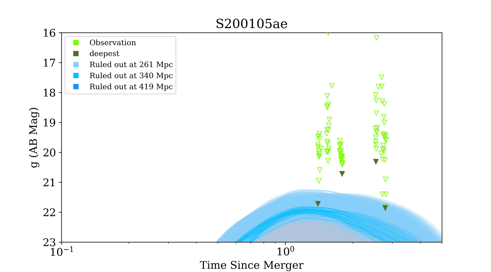
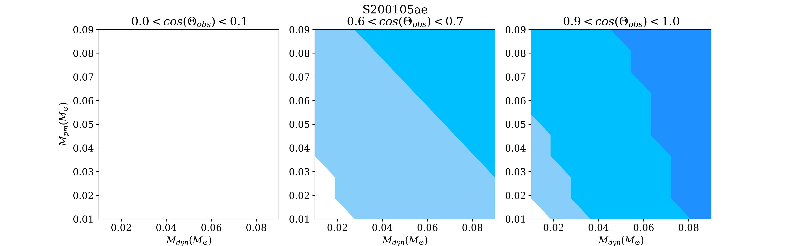

Module
================

Model
~~~~~~~~~~~~~~~~~

Constraint
~~~~~~~~~~~~~~~~~

Model Constraint
----------------

This module provide a KN parameter constraints without EM conterpart detection but upper limit.

Before you start, you should define model you use in the module. For instance, default model is BHNS model by
``Dietrich el at``, and BNS model by ``Bulla``. For flexibility, I will upgrade a surrogate model by myself and 
a training module that could fit any model you input.

After definition of KN model, you and inject parameter ranges and an event.

.. code-block::python

    file_name = '/home/Aujust/data/Kilonova/possis/Model Constraints/ZTF_fields_LALInf_S200105ae.dat'
    A = model_constraint(file_name,'deepest',5,id_list=[1,2])

with ``deepest`` mode and seperate observations to 5 clusters using K-means, and ``filter_ID_list`` is 1 and 2.

Then constraint model parameters and plot.

.. code-block::python

    A.add_params(params)
    A.constraint()
    A.plot_params()
    A.plot_lc(1)

